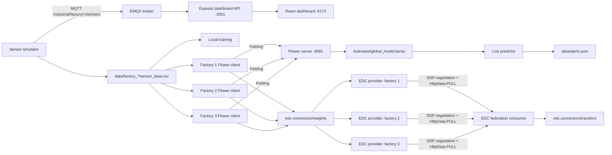

# Industrial Data Space for Predictive Maintenance

An end-to-end demonstrator for privacy-preserving predictive maintenance across
three industrial factories. The project combines:

- deterministic industrial sensor simulation and historical CSV data;
- local and federated binary failure prediction with TensorFlow and Flower;
- Eclipse Dataspace Components (EDC) for policy-controlled model-weight
  exchange;
- MQTT for live telemetry;
- a React/Vite dashboard and an Express API for monitoring factories, alerts,
  federated metrics, MQTT, and EDC availability.

The project is designed to run locally on Windows. The commands below use
PowerShell and should be executed from the repository root.

## Architecture



### Main data flows

1. `simulator/stream_simulator.py` generates deterministic historical data for
   factories `F1`, `F2`, and `F3`.
2. Each Flower client reads one factory's CSV, applies the shared scaler, trains
   the same neural network locally, and exports that round's weights as JSON.
3. The Flower server aggregates the client weights with weighted FedAvg, saves
   the global Keras model, and records round metrics.
4. The EDC runner publishes each round's weight file as a provider asset,
   discovers it through the consumer catalog, negotiates a contract, and pulls
   the file into `edc-connectors/transfers/`.
5. The dashboard API reads the CSV/model artifacts and subscribes to MQTT live
   measurements. The React UI polls the API and consumes its server-sent event
   stream.

## Repository map

| Path | Purpose |
| --- | --- |
| `data/` | Historical sensor CSVs, latest measurements, and generated alerts |
| `simulator/` | Historical backfill, realtime measurements, MQTT publisher/subscriber, and live prediction |
| `federated/` | Flower server/client, shared preprocessing, global model, and metrics |
| `ml/` | Standalone Random Forest baseline for local factory training |
| `edc-connectors/provider/` | Provider configurations for factories 1-3 |
| `edc-connectors/consumer/` | Consumer and federation-server configurations |
| `edc-connectors/scripts/` | Connector launcher and automated transfer runners |
| `edc-connectors/edc-runtime/` | Gradle projects that build the provider and consumer JARs |
| `edc-connectors/weights/` | Per-factory, per-round exported model weights |
| `edc-connectors/transfers/` | Files received through the EDC data-space flow |
| `dashboard/backend/` | Express API, MQTT subscriber, CSV persistence, and EDC health checks |
| `dashboard/frontend/` | React/Vite monitoring dashboard |
| `runtime-logs/` | Runtime logs generated by the local launch scripts |

## Prerequisites

- Windows PowerShell.
- Python 3.12. TensorFlow 2.18 is the tested target in this project.
- Node.js and npm.
- Java available on `PATH` or configured through `JAVA_HOME` for EDC.
- Internet access to install packages and, unless replaced by a local broker,
  reach `broker.emqx.io:1883`.

Check the tools before starting:

```powershell
py --version
node --version
npm --version
java -version
```

## Installation

Create the Python environment and install the pinned ML dependencies:

```powershell
py -3.12 -m venv .venv312
.\.venv312\Scripts\python.exe -m pip install --upgrade pip
.\.venv312\Scripts\python.exe -m pip install -r requirements.txt
```

Install the dashboard dependencies:

```powershell
Push-Location dashboard\backend
npm install
Pop-Location

Push-Location dashboard\frontend
npm install
Pop-Location
```

Build the EDC connector JARs once before starting the connectors:

```powershell
Push-Location edc-connectors\edc-runtime
.\gradlew.bat build
Pop-Location
```

The launcher expects these generated artifacts:

- `edc-runtime\transfer\transfer-03-consumer-pull\provider-proxy-data-plane\build\libs\connector.jar`
- `edc-runtime\transfer\transfer-00-prerequisites\connector\build\libs\connector.jar`

## Container deployment

Docker Compose runs the dashboard, a local Mosquitto broker, the three Flower
clients and server, the three EDC providers, and the EDC consumer. It stores
sensor CSVs and EDC round weights in the repository and federated artifacts in
a named Docker volume. Start Docker Desktop first, then run from the repository
root:

```powershell
docker compose up --build -d
docker compose ps
```

Open <http://localhost:8088/>. The API is available at
<http://localhost:3001/> and the local MQTT broker at `localhost:1884` (the
broker listens on port `1883` inside the Docker network).
Flower's federated server is exposed on `localhost:8081`. Follow training with
`docker compose logs -f federated-server federated-client-f1 federated-client-f2 federated-client-f3`.
After each successful FedAvg aggregation, the Flower server automatically
runs the EDC catalog, contract negotiation, and transfer flow for that round's
three factory weight files. Round summaries and JSON protocol traces are
written under `edc-connectors\transfers\`. If any factory transfer fails, the
server reports the failure and stops rather than treating the round as fully
published.
The Compose stack uses a local anonymous Mosquitto broker for demonstration;
do not expose it to an untrusted network.

To replay a round manually from the host, use the providers' mapped
management/DSP ports and the in-cluster weights service:

```powershell
.\.venv312\Scripts\python.exe edc-connectors\scripts\run_federated_round.py `
  --round 1 `
  --source-base-url http://weights:8000 `
  --no-source-server `
  --continue-on-error
```

To stop the services without deleting persisted data, run
`docker compose down`. The sensor CSVs and weight files are bind-mounted from
the repository; federated metrics and the global model are kept in the
`federated-artifacts` volume.

## Kubernetes deployment (Minikube or Kind)

Build the local images from the repository root:

```powershell
docker build -t industrial-python:local .
docker build -t industrial-dashboard-api:local .\dashboard\backend
docker build -t industrial-dashboard-frontend:local .\dashboard\frontend
docker build -f .\edc-connectors\Dockerfile `
  --build-arg CONNECTOR_MODULE=transfer/transfer-03-consumer-pull/provider-proxy-data-plane `
  -t industrial-edc-provider:local .
docker build -f .\edc-connectors\Dockerfile `
  --build-arg CONNECTOR_MODULE=transfer/transfer-00-prerequisites/connector `
  -t industrial-edc-consumer:local .
```

For Kind, load those five images into the cluster (replace `kind` with the
cluster name if different):

```powershell
kind load docker-image industrial-python:local --name kind
kind load docker-image industrial-dashboard-api:local --name kind
kind load docker-image industrial-dashboard-frontend:local --name kind
kind load docker-image industrial-edc-provider:local --name kind
kind load docker-image industrial-edc-consumer:local --name kind
```

For Minikube, use `minikube image load <image>` for each of the same image
names. Apply the namespace, PVCs, services, deployments, jobs, and generated
EDC/Mosquitto ConfigMaps with:

```powershell
kubectl apply -k .\k8s
kubectl get pods,jobs,pvc -n industrial-data-space
```

The data-init Job creates the three CSV datasets in the `project-data` PVC.
Each Flower client mounts only its own factory CSV subdirectory read-only;
federated model/metrics and exported weights are stored in the
`federated-artifacts` PVC. The Flower server and clients run as finite Jobs.
The dashboard is exposed on NodePort `30080`; for Kind or a browser on the
local machine, use:

```powershell
kubectl port-forward -n industrial-data-space service/dashboard-frontend 8088:80
```

Then open <http://localhost:8088/>. Check the data generation and training
results with:

```powershell
kubectl logs -n industrial-data-space job/data-init
kubectl logs -n industrial-data-space job/federated-client-f1
kubectl logs -n industrial-data-space job/federated-client-f2
kubectl logs -n industrial-data-space job/federated-client-f3
```

After each successful FedAvg aggregation, the Flower server Job automatically
publishes, negotiates, and transfers all three round-weight files through the
EDC services. Summaries and protocol traces are persisted at
`/artifacts/transfers` on the `federated-artifacts` PVC.

To run the EDC transfer scripts from the host, forward the consumer management
API and each provider's management/DSP ports in separate terminals:

```powershell
kubectl port-forward -n industrial-data-space service/edc-consumer 29193:8281
kubectl port-forward -n industrial-data-space service/edc-provider-1 19193:8181 19194:8184
kubectl port-forward -n industrial-data-space service/edc-provider-2 21193:8181 21194:8184
kubectl port-forward -n industrial-data-space service/edc-provider-3 23193:8181 23194:8184
```

After training has exported the requested round weights, the provider can fetch
them from the in-cluster `weights` service:

```powershell
.\.venv312\Scripts\python.exe edc-connectors\scripts\run_federated_round.py `
  --round 1 `
  --source-base-url http://weights:8000 `
  --no-source-server `
  --continue-on-error
```

Kubernetes uses the cluster's default StorageClass. Minikube and Kind are
single-node demo targets here; use dedicated storage, credentials, TLS,
network policies, and authenticated MQTT before any multi-node or production
deployment. The broker configuration in this prototype allows anonymous
connections and is intended only for the cluster's internal network.

## Quick start: complete local stack

Use separate PowerShell terminals for long-running processes. Run the
following steps from the repository root.

### 1. Generate historical factory data

This writes 12,000 one-minute samples per factory to
`data/factory_1/sensor_data.csv`, `data/factory_2/sensor_data.csv`, and
`data/factory_3/sensor_data.csv`. It also refreshes each
`data/factory_*/latest.json`.

```powershell
.\.venv312\Scripts\python.exe simulator\generate_data.py
```

Each row contains:

```text
timestamp,factory_id,temperature,vibration,pressure,humidity,energy_consumption,state
```

The model features are `temperature`, `vibration`, `pressure`, `humidity`, and
`energy_consumption`. The binary label is `state`, with values `normal` and
`failure`.

### 2. Start the EDC runtimes

```powershell
.\edc-connectors\scripts\start_connectors.ps1
```

This starts three provider connectors, one consumer, and one federation-server
process. Logs are written to `edc-connectors\runtime-logs\`.

The default provider management and DSP ports are:

| Participant | Management | DSP protocol | Public data plane |
| --- | ---: | ---: | ---: |
| Factory 1 | `19193` | `19194` | `19291` |
| Factory 2 | `21193` | `21194` | `21291` |
| Factory 3 | `23193` | `23194` | `23291` |
| Federation consumer | `29193` | `29194` | `29291` |
| Federation server | `59193` | `59194` | `59291` |

The DSP protocol used by the scripts is
`dataspace-protocol-http:2025-1`.

To start only the providers:

```powershell
.\edc-connectors\scripts\start_connectors.ps1 -SkipConsumer
```

### 3. Run federated learning

Start the server first:

```powershell
$env:SERVER_ADDRESS = "127.0.0.1:8081"
$env:NUM_ROUNDS = "5"
$env:NUM_CLIENTS = "3"
.\.venv312\Scripts\python.exe federated\server.py
```

Then start one client per factory in separate terminals:

```powershell
$env:SERVER_ADDRESS = "127.0.0.1:8081"
.\.venv312\Scripts\python.exe federated\client.py factory_1
```

```powershell
$env:SERVER_ADDRESS = "127.0.0.1:8081"
.\.venv312\Scripts\python.exe federated\client.py factory_2
```

```powershell
$env:SERVER_ADDRESS = "127.0.0.1:8081"
.\.venv312\Scripts\python.exe federated\client.py factory_3
```

The server requires all three clients by default. After each successful
training round:

- the client exports
  `edc-connectors\weights\factory_N\round_NNN.json`;
- the server updates `federated\global_model.keras`;
- aggregated metrics are appended to `federated\results\metrics.json`.

The client and server use the same five-feature network:

```text
Input(5) -> Dense(32, relu) -> Dense(16, relu) -> Dense(1, sigmoid)
```

The shared preprocessing constants are defined in
`federated/preprocessing.py`; do not change the client and live predictor
scaling independently.

### 4. Run the EDC transfer round

After the clients have produced the requested round's files:

```powershell
.\.venv312\Scripts\python.exe edc-connectors\scripts\run_federated_round.py `
  --round 1 `
  --continue-on-error `
  --summary-path .\edc-connectors\transfers\round_001_summary.json
```

The runner invokes the single-factory pipeline for factories 1, 2, and 3.
Successful transfers are written to:

```text
edc-connectors/transfers/factory_1/round_001.json
edc-connectors/transfers/factory_2/round_001.json
edc-connectors/transfers/factory_3/round_001.json
```

The command exits with a non-zero status if any selected factory fails. Use
`--factory 1 --factory 3` to run a subset.

For one factory only:

```powershell
.\.venv312\Scripts\python.exe edc-connectors\scripts\run_file_pipeline.py `
  --factory 1 `
  --round 1 `
  --trace-dir .\edc-connectors\transfers\_trace\factory_1_round_001
```

The single-factory pipeline creates or reuses the provider policy, asset, and
contract definition; requests the catalog; negotiates the contract; starts an
`HttpData-PULL` transfer; waits for the EDR; and writes the received file.
Unless `--no-source-server` is specified, it serves `edc-connectors\weights`
through a temporary HTTP server on port `8000`.

### 5. Start the dashboard

Start the API:

```powershell
Push-Location dashboard\backend
node server.js
```

In another terminal, start the Vite frontend:

```powershell
Push-Location dashboard\frontend
npm run dev
```

Open <http://localhost:5173/>. The API is available at
<http://localhost:3001/>.

The dashboard reads:

- factory status and latest data from `data/factory_*/sensor_data.csv`;
- federated metrics from `federated/results/metrics.json`, falling back to
  `dashboard/backend/fl_metrics.json`;
- EDC availability by checking the three provider management ports;
- live telemetry through MQTT and the API server-sent event endpoint.

### 6. Publish live MQTT measurements

The simulator publishes one measurement per factory every 30 seconds to the
public broker `broker.emqx.io`:

```powershell
.\.venv312\Scripts\python.exe simulator\mqtt_simulator.py
```

Topics are:

```text
industrial/factory/F1/sensors
industrial/factory/F2/sensors
industrial/factory/F3/sensors
```

The dashboard backend subscribes to
`industrial/factory/+/sensors`, persists received rows to the factory CSVs,
and broadcasts updates through `/api/stream`.

## Optional workflows

### Local Random Forest baseline

This is independent of Flower and is useful for a per-factory baseline:

```powershell
.\.venv312\Scripts\python.exe ml\local_training.py
```

It trains a balanced `RandomForestClassifier` for each factory and prints
accuracy, F1, and a classification report.

### Live prediction and alerts

Once `federated\global_model.keras` exists, predict from the latest factory
measurements:

```powershell
.\.venv312\Scripts\python.exe simulator\live_predictor.py
```

This writes the most recent 50 alerts to `data\alerts.json`. The threshold is
configurable:

```powershell
$env:ALERT_THRESHOLD = "0.6"
.\.venv312\Scripts\python.exe simulator\live_predictor.py
```

Other useful environment variables:

| Variable | Default | Used by |
| --- | --- | --- |
| `DATA_DIR` | repository `data` directory | simulator and federated clients |
| `SERVER_ADDRESS` | `127.0.0.1:8080` for clients/server defaults | Flower client/server |
| `NUM_ROUNDS` | `5` | Flower server |
| `NUM_CLIENTS` | `3` | Flower server |
| `EDC_PUBLISH_ENABLED` | `false` | Flower server; enable EDC transfer processing after each FedAvg round |
| `EDC_SOURCE_DIR` | `edc-connectors/weights` | Flower server; exported client weights |
| `EDC_SOURCE_BASE_URL` | `http://weights:8000` when EDC publishing is enabled | EDC provider's weight-file source |
| `EDC_TRANSFER_DIR` | `edc-connectors/transfers` | Flower server; received files and round summaries |
| `EDC_TRACE_DIR` | `<EDC_TRANSFER_DIR>/_trace` | Flower server; per-factory EDC protocol traces |
| `MODEL_PATH` | `federated/global_model.keras` | live predictor |
| `ALERT_THRESHOLD` | `0.5` | live predictor |
| `MQTT_BROKER_URL` | `mqtt://broker.emqx.io:1883` | dashboard backend |
| `MQTT_TOPIC` | `industrial/factory/+/sensors` | dashboard backend |
| `VITE_API_BASE_URL` | `http://localhost:3001` | frontend |
| `VITE_EDC_F1_URL` | `http://localhost:19193/management/v3` | frontend EDC status |
| `VITE_EDC_F2_URL` | `http://localhost:21193/management/v3` | frontend EDC status |
| `VITE_EDC_F3_URL` | `http://localhost:23193/management/v3` | frontend EDC status |

## Dashboard API reference

| Endpoint | Description |
| --- | --- |
| `GET /api/health` | API and MQTT health summary |
| `GET /api/factories` | Current status for F1-F3 |
| `GET /api/factories/:id/latest` | Latest measurement for a factory |
| `GET /api/factories/:id/history?limit=30` | Recent measurements |
| `GET /api/fl/metrics` | Flower round metrics |
| `GET /api/mqtt/status` | MQTT connection status |
| `GET /api/edc/status` | Availability of provider management ports |
| `GET /api/stream` | Server-sent events for live dashboard updates |

## Troubleshooting

### TensorFlow or Python package installation fails

Use Python 3.12 and the repository virtual environment explicitly:

```powershell
.\.venv312\Scripts\python.exe -m pip --version
.\.venv312\Scripts\python.exe -m pip install -r requirements.txt
```

### EDC launcher reports a missing JAR

Build the runtime from `edc-connectors\edc-runtime` and check that Java is
available:

```powershell
Push-Location edc-connectors\edc-runtime
.\gradlew.bat build
Pop-Location
java -version
```

### A federated client cannot connect

Confirm that the server is already running, that `SERVER_ADDRESS` is identical
in every terminal, and that all three clients use the matching factory names
`factory_1`, `factory_2`, and `factory_3`.

### An EDC transfer fails

Check:

1. the provider and consumer processes in `edc-connectors\runtime-logs\`;
2. the provider management/DSP ports in the table above;
3. that the expected source file exists under
   `edc-connectors\weights\factory_N\round_NNN.json`;
4. the JSON traces under `edc-connectors\transfers\_trace\`;
5. the generated round summary when using `--summary-path`.

### The dashboard shows no live MQTT data

Confirm that the backend is running and that its `MQTT_BROKER_URL` and
`MQTT_TOPIC` match the simulator. The dashboard can still display CSV fallback
data generated by `simulator\generate_data.py`.

## Generated artifacts and version-control notes

The following are runtime outputs and may be regenerated:

- `.venv312/`;
- Node.js dependency directories and npm caches;
- `runtime-logs/`;
- `edc-connectors/transfers/`;
- per-round weight exports under `edc-connectors/weights/`;
- `data/alerts.json`;
- Flower metrics and the global model.

The most useful retained project artifacts are:

- `federated/global_model.keras`;
- `federated/results/metrics.json`;
- EDC round summaries and trace JSON files when documenting a demonstration.

## Project status and scope

This repository is a local demonstrator. The EDC configurations use local
HTTP endpoints, mock/local connector configuration, in-memory connector
stores, and a public MQTT broker by default. For production deployment,
replace those defaults with authenticated identities, durable stores, private
networking, managed secrets, broker access control, TLS, and monitored
infrastructure.

The EDC-specific implementation notes and pipeline details are documented in
[`edc-connectors/README.md`](edc-connectors/README.md) and
[`edc-connectors/EDC_Pipeline.md`](edc-connectors/EDC_Pipeline.md).
